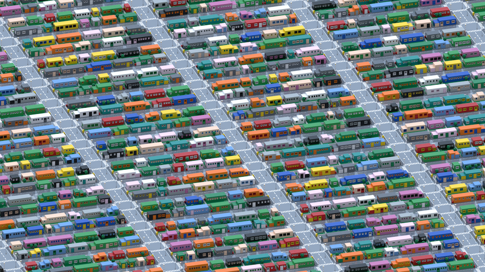

= Lego constructions

This is a playground to test generating LEGO constructions.

Code is probably a mess and only intended for my own use, buyer beware!

The scripts generate LDR files that use the link:https://www.ldraw.org/article/218.html[LDraw file format].

To see the result you can use a program like link:https://www.leocad.org[leoCAD] or link:https://www.bricklink.com/v3/studio/download.page[Studio]. Studio can also generate nice renderings.

== Suburb

The `suburbs` directory generates suburb landscapes, run the `city.rb` to generate a `result.ldr` file.
